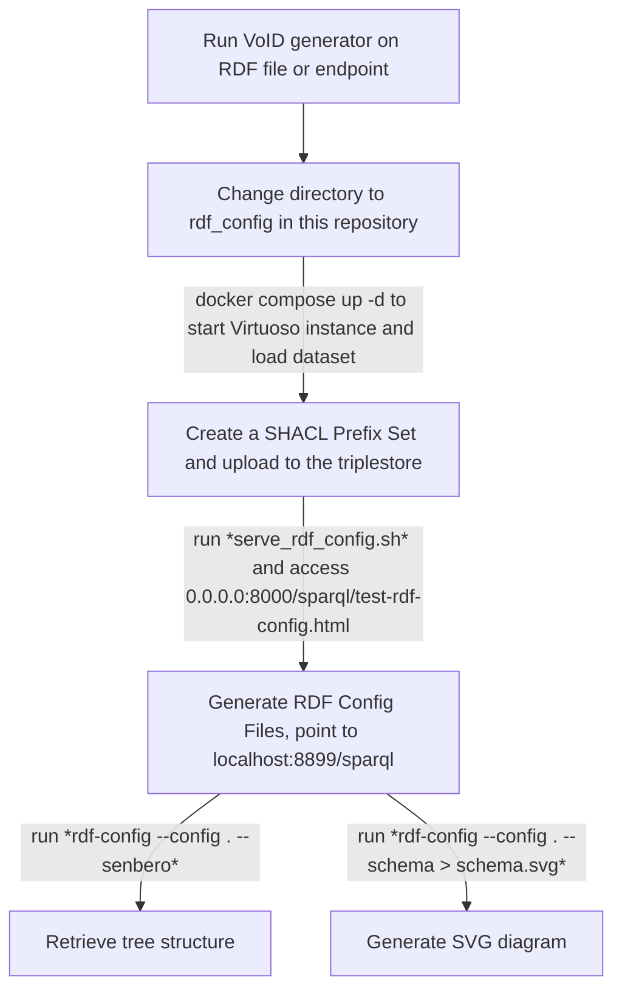

	
#### corresponding authors: t.abbassidaloii\@maastrichtuniversity.nl and yojana.gadiya\@itmp.fraunhofer.de

#### * These authors contributed equally to this work

# Introduction

# Goals for the biohackathon (@tabbassidaloii)
One of the main aims of our project was to enhance FAIR data integration by clarifying and transforming graph schemas. To achieve this we defined the tasks below
- Comparison and documentation of the synergies among different tools for extracting data models: RDF-Config, VoID generator and sheXer.
- Translate schemas into annotators to enable future automation.
We also wanted to improve the BioDataFuse [**ref**] functionality through:
- Expand the data model of BioDataFuse using resources from the RDF Portal.
- Integrate the output graph with LLM models.

# Comparision of schema extractor tools (@YojanaGadiya)

## Table 1. Overview of tools compared during the hacking week

|  | [VoID generator](https://github.com/JervenBolleman/void-generator) | [RDF-Config](https://github.com/JervenBolleman/void-generator) | [sheXer](https://github.com/JervenBolleman/void-generator) |
|---|---|---|---|
| **Summary / What does the tool do?** | Extracts statistics from an RDF endpoint or file | Automates SPARQL and schema generation; creates a GraphQL instance of an RDF graph |  |
| **Documentation** | [Incomplete](https://github.com/JervenBolleman/void-generator/blob/main/Tutorial.md) | [Present](https://github.com/JervenBolleman/void-generator/blob/main/Tutorial.md) | [Present](https://github.com/DaniFdezAlvarez/shexer/blob/master/README.md) |
| **Minimal requirement** | Requires an RDF file or SPARQL endpoint; Graph must have triples with rdf:type predicates | Requires Model.yaml and Prefix.yaml files | Requires a Turtle file |
| **Data model representation (output)** | Object class-based file detailing all classes and properties | SVG tree structure representing classes and properties | PNG image of classes and properties |
| **Process** | Automated | Semi-automated | Automated |
| **Interpretability of schema representation** | Difficult; requires programming knowledge to understand classes and properties | Easy; human-readable terms make tree structure easily understandable | Easy; graphical representation facilitates quick interpretation |
| **Ontologies** | Human-readable terms; more compatible with programming language formats | Human-readable terms | Uses ontology identifiers, making readability difficult |
| **Error logging** | Errors are not easily readable | Vague error logs | Errors are not readable or understandable; large images may be truncated |
| **Error reporting** | Through Git issues | Through Git issues |  |
| **Compiler** | Java-based; Native binary | Ruby-based | Python-based |
| **Limitation** | Quadratic runtime for generating files (e.g., IDSM, OrthoDB) | Not applicable for shape classes (e.g., Rhea) | Requires manual curation of input (Solution: integrate with VoID generators for curation) |

# Fatilitate the addition of new annotators to pyBiodatafuse (@tabbassidaloii)
Project #14

# Using LLM to query BDF knowledge graph (@jmillanacosta)
Project #4, 
- concept:

# Improvement in the pyBiodatafuse (@tabbassidaloii)
- adding the version to data extracted from IDSM
- improving the Bgee query
- 
# Discussion (@tabbassidaloii)
- standard data models 

# Future works
- learning from project #2, we will explore annotating the output knowledge graph with the [Croissant schema](https://docs.mlcommons.org/croissant/docs/croissant-spec.html)
- Support VCF (project 35)
- LLM integration to generate SPARQL queries from natural language (Project #4)

## Acknowledgements

This work was supported by ELIXIR, the research infrastructure for life-science data. We thank the organizers of the BioHackathon Europe 2024 for providing travel support for the project leads.

## References
