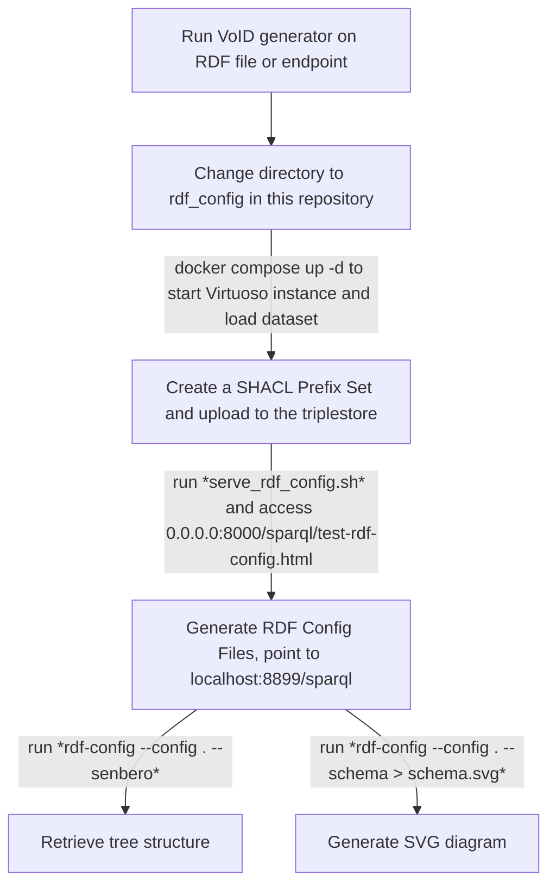

	
#### corresponding authors: t.abbassidaloii\@maastrichtuniversity.nl and yojana.gadiya\@itmp.fraunhofer.de

#### * These authors contributed equally to this work

# Introduction
The integration of life science data across diverse biomedical resources remains a significant challenge, due to fragmented data sources, varying data formats, and the use of multiple ontologies to describe similar contexts. To address these issues, we launched the [BioDataFuse (BDF) project](https://biodatafuse.org) [@AuthorSelfCitation:biodatafuse2023], which applies a modular framework to harmonize and integrate data from various sources into context-specific knowledge graphs. To date, the BDF project has successfully integrated and harmonized data from ten databases, demonstrating the effectiveness of BDF's modular approach in creating unified, interoperable datasets.
However, achieving this level of integration requires a deep understanding of the underlying graph schemas from each data source. In this biohackathon, our goal was to further refine and streamline the data integration process, aiming to make it more seamless, adaptable, and FAIR-compliant. By creating a robust approach, we envision that any biological database adhering to FAIR principles could be readily integrated into the BDF framework and contribute to a unified data ecosystem.

## Goals for the biohackathon
Our main objective for this biohackathon was to enhance FAIR data integration by clarifying and transforming graph schemas. To achieve this, we outlined the following tasks:
- Compare and document the synergies among various tools for extracting data models, including RDF-Config, VoID generator, and sheXer.
- Translate schemas into annotators to enable future automation.

We also aimed to extend the capabilities of BioDataFuse by:
- Expanding the data model of BioDataFuse with resources from the RDF Portal.
- Integrating BioDataFuse output graphs with LLM models to explore new opportunities for automated reasoning and data interpretation.

# Comparision of schema extractor tools (@YojanaGadiya)

## Table 1. Overview of tools compared during the hacking week

|  | [VoID generator](https://github.com/JervenBolleman/void-generator) | [RDF-Config](https://github.com/JervenBolleman/void-generator) | [sheXer](https://github.com/JervenBolleman/void-generator) |
|---|---|---|---|
| **Summary / What does the tool do?** | Extracts statistics from an RDF endpoint or file | Automates SPARQL and schema generation; creates a GraphQL instance of an RDF graph |  |
| **Documentation** | [Incomplete](https://github.com/JervenBolleman/void-generator/blob/main/Tutorial.md) | [Present](https://github.com/JervenBolleman/void-generator/blob/main/Tutorial.md) | [Present](https://github.com/DaniFdezAlvarez/shexer/blob/master/README.md) |
| **Minimal requirement** | Requires an RDF file or SPARQL endpoint; Graph must have triples with rdf:type predicates | Requires Model.yaml and Prefix.yaml files | Requires a Turtle file |
| **Data model representation (output)** | Object class-based file detailing all classes and properties | SVG tree structure representing classes and properties | PNG image of classes and properties |
| **Process** | Automated | Semi-automated | Automated |
| **Interpretability of schema representation** | Difficult; requires programming knowledge to understand classes and properties | Easy; human-readable terms make tree structure easily understandable | Easy; graphical representation facilitates quick interpretation |
| **Ontologies** | Human-readable terms; more compatible with programming language formats | Human-readable terms | Uses ontology identifiers, making readability difficult |
| **Error logging** | Errors are not easily readable | Vague error logs | Errors are not readable or understandable; large images may be truncated |
| **Error reporting** | Through Git issues | Through Git issues |  |
| **Compiler** | Java-based; Native binary | Ruby-based | Python-based |
| **Limitation** | Quadratic runtime for generating files (e.g., IDSM, OrthoDB) | Not applicable for shape classes (e.g., Rhea) | Requires manual curation of input (Solution: integrate with VoID generators for curation) |

# Facilitating the addition of new annotators to pyBiodatafuse
To extend [pyBiodatafuse](https://github.com/BioDataFuse/pyBiodatafuse.git)’s functionality and support ongoing alignment with related projects, we identified a valuable integration opportunity with Project #14’s [sparql-void-to-python tool](https://github.com/TRIPLE-CHIST-ERA/sparql-void-to-python.git). This tool utilizes the VoID file to automatically generate Python APIs that include all classes and properties within an RDF database.
Building on this capability, we developed a generic template that enables the streamlined addition of new annotators to pyBiodatafuse. This template leverages the Python API generated by sparql-void-to-python to facilitate the creation of database-specific annotators directly within the BioDataFuse (BDF) framework. By adopting this approach, we anticipate simplifying the integration of new RDF databases into BDF, making the process more efficient and consistent across different data sources.

# Using LLM to query BDF knowledge graph (@jmillanacosta)
Project #4, 
- concept:

# Improvement in the pyBiodatafuse (@tabbassidaloii)
- adding the version to data extracted from IDSM
- improving the Bgee query
- 
# Discussion (@tabbassidaloii)
- standard data models 

# Future works
- learning from project #2, we will explore annotating the output knowledge graph with the [Croissant schema](https://docs.mlcommons.org/croissant/docs/croissant-spec.html)
- Support VCF (project 35)
- LLM integration to generate SPARQL queries from natural language (Project #4)

## Acknowledgements

This work was supported by ELIXIR, the research infrastructure for life-science data. We thank the organizers of the BioHackathon Europe 2024 for providing travel support for the project leads.

## References
