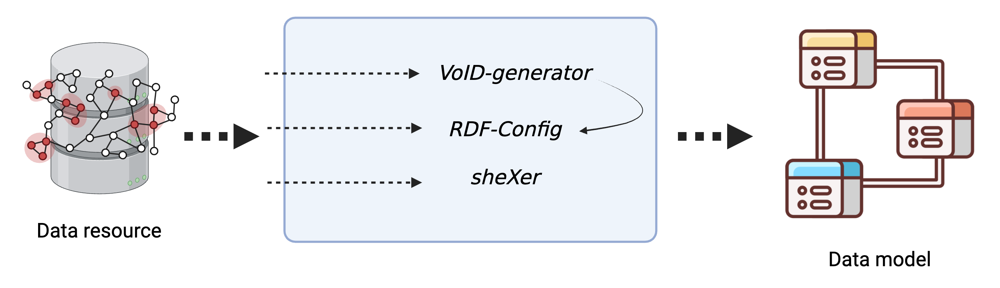
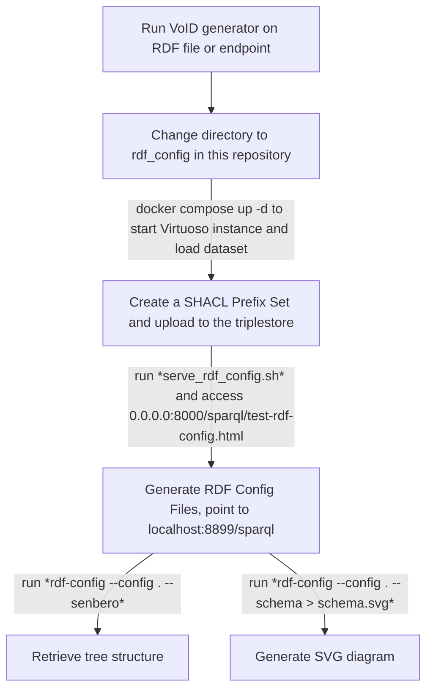

	
#### corresponding authors: t.abbassidaloii\@maastrichtuniversity.nl and yojana.gadiya\@itmp.fraunhofer.de

#### * These authors contributed equally to this work

# Introduction
The integration of life science data across diverse biomedical resources remains a significant challenge, due to fragmented data sources, varying data formats, and the use of multiple ontologies to describe similar contexts. To address these issues, we launched the [BioDataFuse (BDF) project](https://biodatafuse.org) [@AuthorSelfCitation:biodatafuse2023], which applies a modular framework to harmonize and integrate data from various sources into context-specific knowledge graphs. To date, the BDF project has successfully integrated and harmonized data from ten databases, demonstrating the effectiveness of BDF's modular approach in creating unified and interoperable datasets.

However, achieving this level of integration requires a deep understanding of the underlying graph schemas from each data source. In this biohackathon, our goal was to refine further and streamline the data integration process, aiming to make it more seamless, adaptable, automatized, and FAIR-compliant. By creating a robust approach, we envision that any biological database adhering to FAIR principles could be readily integrated into the BDF framework and contribute to a unified data ecosystem.

## Goals for the biohackathon
Our main objective for this biohackathon was to enhance FAIR data integration by clarifying and transforming graph schemas. To achieve this, we outlined the following tasks:
- Compare and document the synergies among various tools for extracting data models, including RDF-Config, VoID generator, and sheXer.
- Translate schemas into annotators to enable future automation.

We also aimed to extend the capabilities of BioDataFuse by:
- Expanding the data model of BioDataFuse with resources from the RDF Portal.
- Integrating BioDataFuse output graphs with LLM models to explore new opportunities for automated reasoning and data interpretation.

# Comparative study of schema extractor tools

## Selection of schema extract tools
A number of data schema extractors exist. In this biohackathon, we looked at three such extraction tools: VoID-generator, RDF-Config, and sheXer **(Figure 1)**.

* [VoID-generator](https://github.com/JervenBolleman/void-generator): The tool enables the generation of [Vocabulary of Interlinked Datasets (VoID)](https://www.w3.org/TR/void/) files from an RDF turtle file or a SPARQL endpoint. VoID is a metadata expression language for RDF graphs and allows for efficiently describing the distribution of data elements and their links in an RDF graph. Hence, by generating such VoID files, the VoID-generator tool enabled making the data and metadata around the graphs discoverable and interoperable.

* [RDF-Config](https://github.com/dbcls/rdf-config): It is a tool to visualize the RDF data structure in a human-readable format based on high quality manual curation of underlying data models. This tool enables making a structured representation of the underlying graph, thus allowing for RDF data management across resources.

* [sheXer](https://github.com/DaniFdezAlvarez/shexer): It is a library to automatic extract of [shape expressions (ShEx)](https://shex.io/) or [Shapes Constraint Language (SHACL)](https://www.w3.org/TR/shacl/) for an RDF graph. ShEx is a schema language, while SHACL is a W3C standard for describing an RDF graph. SheXer as a tool enables quality assurance of the underlying graph by checking compliance with a pre-defined set of rules and constraints.

**Figure 1: Understanding the utility of different.** Here we focused on VoID-generator, RDF-Config, and sheXer with their conversion directly from the RDF resource into a data model. Additionally, we used a tool to convert the VoID file to RDF-Config compliant files for data modeling. 

## Table 1. Pros and Cons of the schema tools

|  | [VoID generator](https://github.com/JervenBolleman/void-generator) | [RDF-Config](https://github.com/JervenBolleman/void-generator) | [sheXer](https://github.com/JervenBolleman/void-generator) |
|---|---|---|---|
| **Overview of the tool** | Extracts statistics from an RDF endpoint or file | Automates SPARQL and schema generation; creates a GraphQL instance of an RDF graph | Extracts ShEx and SHACL structure from an RDF graph; ensure quality assurance and rule compliance of a graph | 
| **Documentation** | [Incomplete](https://github.com/JervenBolleman/void-generator/blob/main/Tutorial.md) | [Present](https://github.com/JervenBolleman/void-generator/blob/main/Tutorial.md) | [Present](https://github.com/DaniFdezAlvarez/shexer/blob/master/README.md) |
| **Minimal requirement** | Requires an RDF file or SPARQL endpoint; Graph must have triples with `rdf:type` predicates | Requires `Model.yaml` and `Prefix.yaml` files | Requires a Turtle file |
| **Data model representation** | Object class-based file detailing all classes and properties | SVG tree structure representing classes and properties | PNG image of classes and properties |
| **Process** | Automated | Semi-automated | Automated |
| **Interpretability of schema representation** | Difficult; requires programming knowledge to understand organization of classes and properties | Easy; human-readable terms make the tree structure representation easily understandable | Easy; graphical representation facilitates quick interpretation |
| **Ontology representation in schema** | Human-readable terms (mapping ontology to labels); more compatible with programming language formats | Human-readable terms | Uses ontology identifiers, making readability difficult |
| **Error logging** | Errors are not easily readable | Errors are not easily readable or vague error logs | Errors are not readable or understandable; large images may be truncated |
| **Error reporting** | Through Git issues | Through Git issues | Through Git issues |
| **Compiler** | Java (Native binary) | Ruby | Python |
| **Limitation** | Quadratic runtime for generating files (e.g., [IDSM](https://idsm.elixir-czech.cz/), [OrthoDB](https://www.orthodb.org/)); Not applicable for shape subclasses (e.g., In [Rhea](https://www.rhea-db.org/), where compounds are sub-classified into products, reactants, etc.) | Requires manual curation of input (Potential solution: integrate with VoID generators for semi-automation) |

## Utilizing the schema tools

As shown in **Table 1**, each of the data schema tools is written in different programming languages. To enable easy use of these tools with minimal interpreter changes, we built a docker environment and detailed step-by-step documentation on the utility of these tools with a locally deployed graph. The documentation is available on [Github](https://github.com/BioDataFuse/elixir_biohackathon_2024/tree/main/void2rdf-config#readme) and discussed in detail in the later sections.

# Facilitating the addition of new annotators to *pyBiodatafuse*

## Semi-automating annotation building with data schemas
To extend [pyBiodatafuse](https://github.com/BioDataFuse/pyBiodatafuse.git)’s functionality and support ongoing alignment with related projects, we identified a valuable integration opportunity with [**Biohackathon Project #14**](). This project discussed the generation of a tool named [sparql-void-to-python tool](https://github.com/TRIPLE-CHIST-ERA/sparql-void-to-python.git) which utilizes the VoID file to automatically generate Python APIs that include all classes and properties within an RDF database.

Building on this capability, we developed a "generic" template that enables the streamlined addition of new annotators to *pyBiodatafuse* (available on [Github](https://github.com/BioDataFuse/pyBiodatafuse/blob/main/src/pyBiodatafuse/annotators/rdf_annotator_template.py)). This template leverages information provided by the Python API from the sparql-void-to-python tool to facilitate the creation of database-specific annotators directly within the BDF framework. By adopting this approach, we anticipate simplifying and fast onboarding the integration of new RDF databases into BDF, making the process more efficient and consistent across different data sources.

# Using LLM to query BDF knowledge graph (@jmillanacosta)
Project #4, 
- concept:

## Evaluating scope of GraphQL interface for RDF-Portal (@Toshiaki) 

Add info here on work done

Overall, the capability to integrate the GraphQL to RDF-Portal opens several opportunities:
* Enabling performing federated queries within the 150 or more data sources in RDF-Portal
* Opening a plugin support for BDF ingestion, expanding its querying capabilities

# Improvement of *pyBiodatafuse*
As part of ongoing efforts to enhance BioDataFuse, some improvements were made during the week:
- **Versioning of IDSM**: With discussion with IDSM developers, we were able to extract and add versioning to the data extracted from this endpoint for better traceability and consistency.
- **Optimized Bgee queries**: With SPARQL experts and Bgee developers, we were able to improve the efficiency of Bgee queries, reducing the query time significantly and enhancing overall performance.
- **Validation of BDF graph**: With data schema tools, we were able to quality check the BDF graph schema and assess the overall quality of our generated RDF graph.

# Improvement of *RDF-Portal* (@Toshiaki and @Shuichi)

# Discussion
- to add points to the discussion with Toshiaki here

# Future Work
With the successful building and understanding of schema alongside cross-project overlaps, we identified a number of future work plan.

### Ingesting more data in BDF

- **Orphanet annotator**: In collaboration with [David Lagorce]() (Orphanet), we aim to develop a specialized annotator for integrating Orphanet data within BDF.

- **VCF file support and variant entity expansion**: Extend BioDataFuse to support variant entities through VCF file integration. This will be explored in collaboration with [Sarang Bhutada]() and [Vibhor Gupta]() (Project #32), and [Alexandrina Bodrug](), enriching BioDataFuse’s handling of variant data.

- **SPARQL-API for annotators**: Leverage the `sparql-void-to-python` package created by Vincent Emonet and Jerven Bolleman (Project #14) to streamline the creation of new BioDataFuse annotators, facilitating the incorporation of diverse RDF data sources.

- **Usecase with Bgee**: Collaborate with Harald Detering (Bgee) to create a use case demonstrating how Bgee gene expression values can be used in spcific research setup.

### Integration with ML models

- **Croissant schema annotation**: Building on insights from [Núria Queralt Rosinach]() (Project #2), we will explore converting and adapting BDF output knowledge graph with the [Croissant schema](https://docs.mlcommons.org/croissant/docs/croissant-spec.html), enhancing data standardization and downstream data analysis with ML tools from Huggingface.

- **LLM integration**: By collaborating with [Tarcisio Mendes De Farias]() (Project #4) to enhance knowledge graph interpretability and usability for a wider range of applications with LLM. Specifically, converting natural language to SPARQL queries for the context specific BDF graph, allowing a chatbot plugin on our graph. 

### Integration with RDF-Portal

- **Using GraphQL interface**: Being the downstream users of the GraphQL interface, we would collaborate with [Toshiaki Katayama]() and [Shuichi Kawashima]() to explore opportunities to build annotators in BDF for RDF-Portal.

## Acknowledgements
This work was supported by ELIXIR, the European research infrastructure for life-science data. We would also like to express our gratitude to the organizers of BioHackathon Europe 2024 for providing travel support for one of the project leads and a participant.

## References
